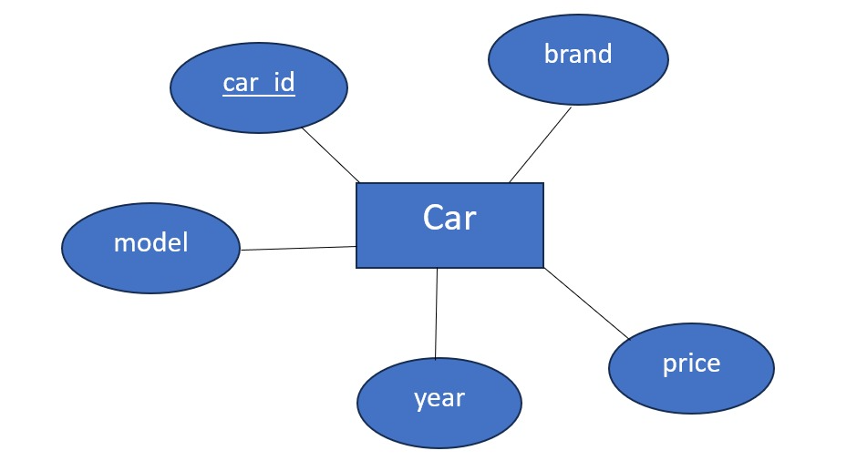

# Ex02 Django ORM Web Application
## Date:13.09.2025

## AIM
To develop a Django application to store and retrieve data from Car Inventory Database using Object Relational Mapping(ORM).

## ENTITY RELATIONSHIP DIAGRAM



## DESIGN STEPS

### STEP 1:
Clone the problem from GitHub

### STEP 2:
Create a new app in Django project

### STEP 3:
Enter the code for admin.py and models.py

### STEP 4:
Execute Django admin and create details for 10 books

## PROGRAM
Models.py:
```
from django.db import models

class Car(models.Model):
    id = models.AutoField(primary_key=True)
    brand = models.CharField(max_length=50)
    model = models.CharField(max_length=50)
    year = models.IntegerField()
    price = models.DecimalField(max_digits=10, decimal_places=2)
    type = models.CharField(max_length=20)

    def __str__(self):
        return f"{self.brand} {self.model} ({self.year})"
```
Admin.py
```
from django.contrib import admin
from .models import Car

@admin.register(Car)
class CarAdmin(admin.ModelAdmin):
    list_display = ('id', 'brand', 'model', 'year', 'price', 'type')
    search_fields = ('brand', 'model')
    list_filter = ('type', 'year')
```


## OUTPUT


## RESULT
Thus the program for creating a database using ORM hass been executed successfully
